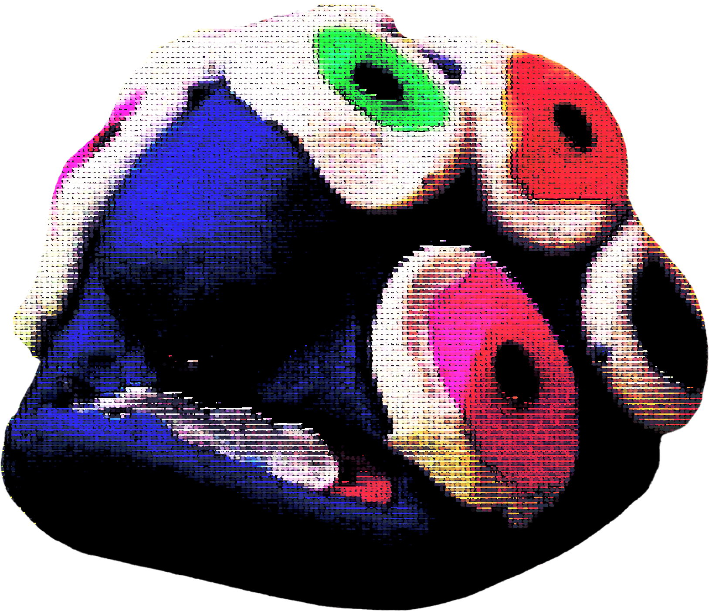

<!DOCTYPE html>
<html>
  

<body>
  

  <marquee>
  
Risin' up, back on the street
Did my time, took my chances
Went the distance, now I'm back on my feet
Just a man and his will to survive
So many times, it happens too fast
You trade your passion for glory
Don't lose your grip on the dreams of the past
You must fight just to keep them alive
It's the eye of the tiger, it's the thrill of the fight
Risin' up to the challenge of our rival
And the last known survivor stalks his prey in the night
And he's watching us all with the eye of the tiger
Face to face, out on the heat
Hangin' tough, stayin' hungry
They stack the odds still we take to the street
For the kill, with the skill to survive
It's the eye of the tiger, it's the thrill of the fight
Risin' up to the challenge of our rival
And the last known survivor stalks his prey in the night
And he's watching us all with the eye of the tiger
Risin' up, straight to the top
Had the guts, got the glory
Went the distance, now I'm not gonna stop
Just a man and his will to survive
It's the eye of the tiger, it's the thrill of the fight
Risin' up to the challenge of our rival
And the last known survivor stalks his prey in the night
And he's watching us all with the eye of the tiger
The eye of the tiger
The eye of the tiger
The eye of the tiger
The eye of the tiger
</marquee>
          
    

  

</body>
</html>
